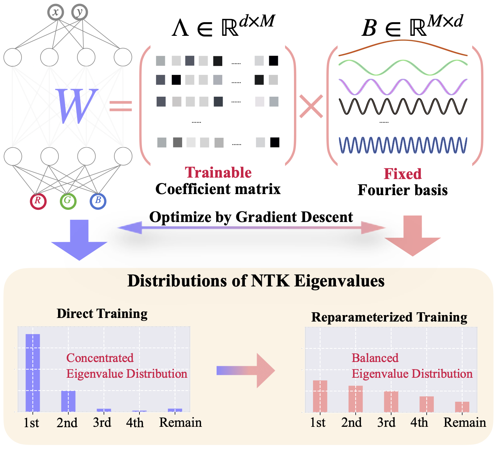
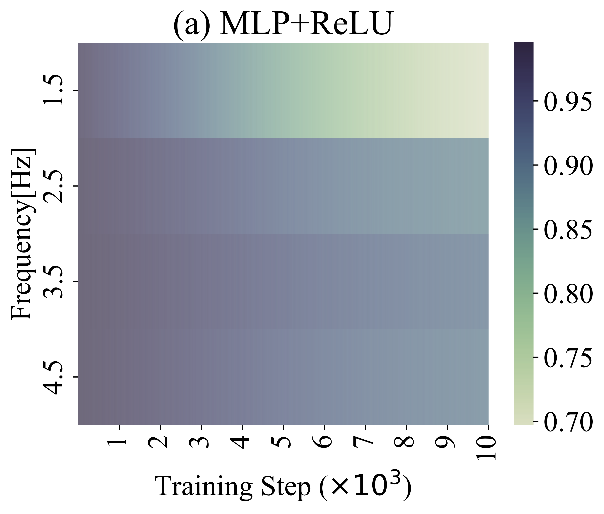
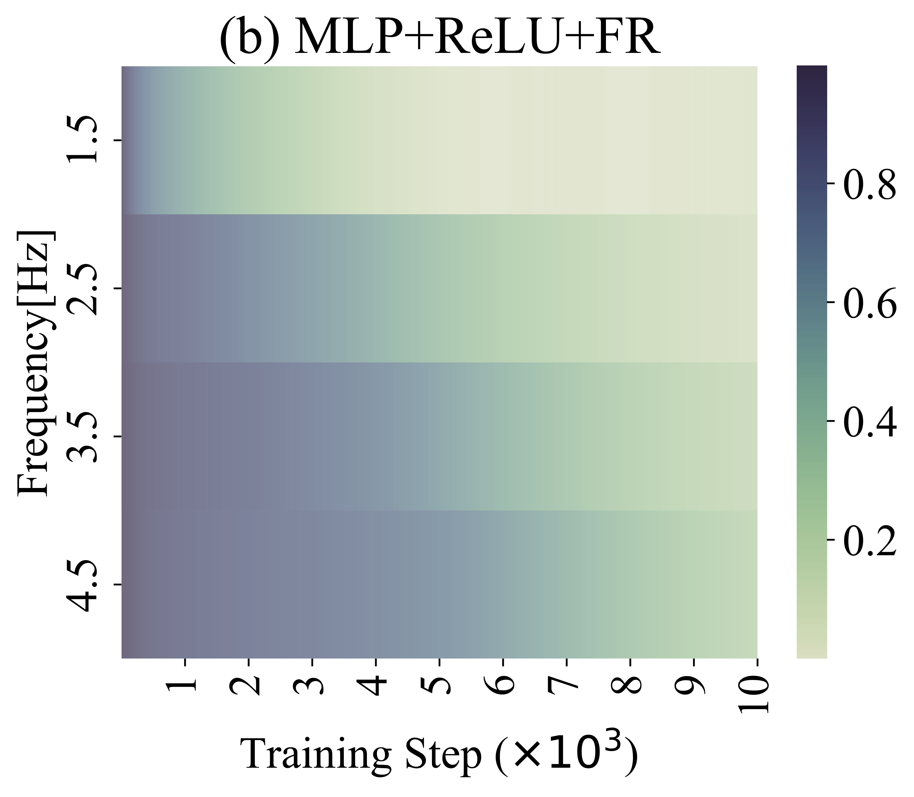
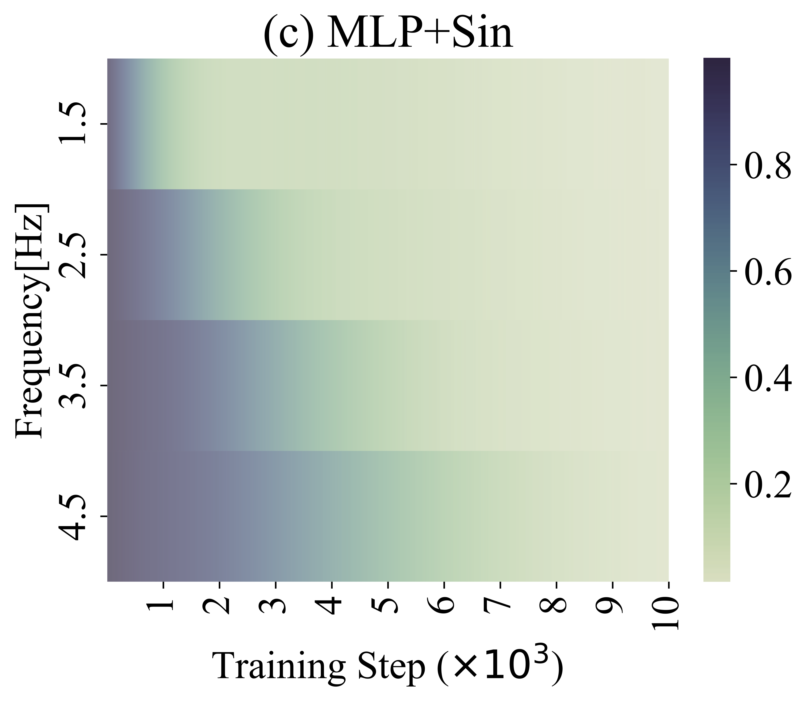
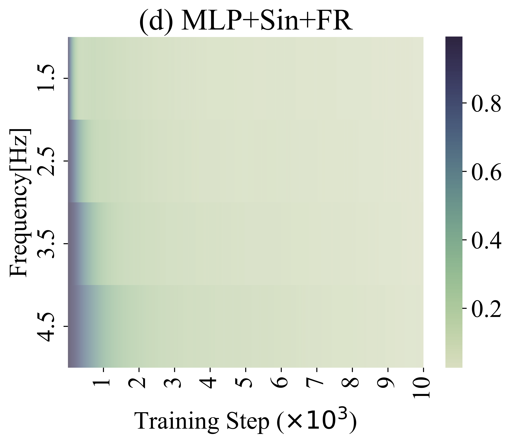
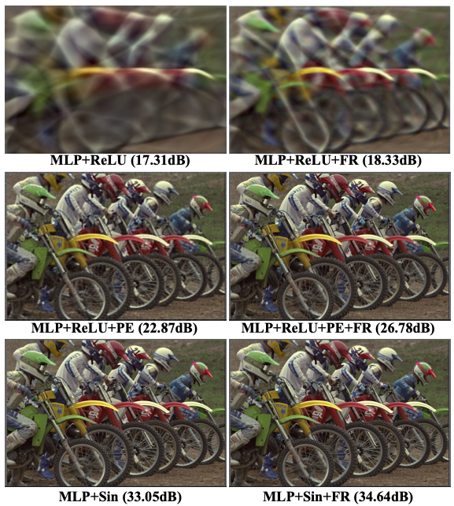

# FR-INR
This repository is the official PyTorch implementation of "Improved Implicit Neural Representation with Fourier Reparameterized Training", CVPR, 2024.
By Kexuan Shi, Xingyu Zhou, Shuhang Gu.
([arxiv](https://arxiv.org/pdf/2401.07402.pdf)) 

💡 Have ideas or questions about FR-INR? Let's chat! 🧠⚡  
📬 Reach me at: [kexuanshi712@gmail.com](mailto:your_email@example.com)  


> **Abstract:** Implicit Neural Representation (INR) as a mighty representation paradigm has achieved success in various computer vision tasks recently. Due to the low-frequency bias issue of vanilla multi-layer perceptron (MLP), existing methods have investigated advanced techniques, such as positional encoding and periodic activation function, to improve the accuracy of INR. In this paper, we connect the network training bias with the reparameterization technique and theoretically prove that weight reparameterization could provide us a chance to alleviate the spectral bias of MLP. Based on our theoretical analysis, we propose a **Fourier reparameterization** method which learns coefficient matrix of fixed Fourier bases to compose the weights of MLP. We evaluate the proposed Fourier reparameterization method on different INR tasks with various MLP architectures, including vanilla MLP, MLP with positional encoding and MLP with advanced activation function, etc. The superiority approximation results on different MLP architectures clearly validate the advantage of our proposed method. Armed with our Fourier reparameterization method, better INR with more textures and less artifacts can be learned from the training data.
> 
> <br/><br/>

## Environment
```bash
conda create -n FR-INR python=3.8
conda activate FR-INR

cd FR-INR
pip install -r requirements.txt
```

## 1D Function fitting
Firstly, running ```1d_function_fitting.py``` to get the fitting results and the empirical Neural Tangent Kernel of Fourier reparameterziation training in 1d function task. Then, running ```1d_relative_error_in_frequency.py``` to analyze the approximation results in the frequency domain.
```bash
python 1d_function_fitting.py
python 1d_relative_error_in_frequency.py
```
<table style="width:100%">
  <tr>
    <td style="width:25%"></td>
    <td style="width:25%"></td>
  </tr>
  <tr>
    <td style="width:25%"></td>
    <td style="width:25%"></td>
  </tr>
</table>


## 2D Image fitting
Using ```2d_image_fitting.py``` to get the fitting results in Image regression task.
```bash
python 2d_image_fitting.py
```
> 

## 3D Occupance
Using ```3D_occupance.py``` to get the results of Thai and Dragon Statue. Before running, you have to unzip the .mat file.
```bash
python 3D_occupance.py
```

## Neural rendering
We provide the core code file ```dvgo.py``` and ```InstantNGP.py```  for DVGO and InstantNGP. The DVGO is recommended to evalute our FR as its official implementation and fast training.

## Citation
    @inproceedings{shi2024improved,
      title={Improved Implicit Neural Representation with Fourier Reparameterized Training},
      author={Shi, Kexuan and Zhou, Xingyu and Gu, Shuhang},
      booktitle={Proceedings of the IEEE/CVF Conference on Computer Vision and Pattern Recognition},
      pages={25985--25994},
      year={2024}
    }
